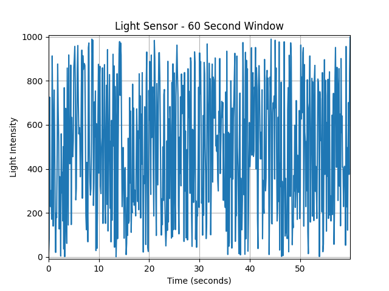

# Documentation for Python Code to Plot Arduino Data in Real-Time

## Overview
This Python code uses the serial library to read data from an Arduino microcontroller, and the matplotlib library to plot the data in real-time. The code continuously reads data from the Arduino and adds it to a list of values that is plotted using matplotlib.

## Dependencies
This code depends on two Python libraries:

1. `serial` - This library provides a way to read data from a serial port. You can install it using the command ``pip install pyserial``.
2. `matplotlib` - This library is used for plotting the data. You can install it using the command ``pip install matplotlib``.

## Usage
1. Connect your Arduino to your computer and make note of the port that it is connected to. In this code, the port is assumed to be `COM4`. You may need to change this depending on your setup.

2. Upload the following code to your Arduino:
```ino
void setup() {
  Serial.begin(9600);
}

void loop() {
  float value = analogRead(A0) / 1023.0 * 5.0;
  Serial.println(value);
  delay(10);
}
```

This code reads the value from analog pin 0, converts it to a voltage between 0 and 5 volts, and sends it to the computer over the serial port.
3. Run the Python code in your preferred Python environment. You should see a live plot of the data from the Arduino.

## Code Explanation

1. Import the necessary libraries:
```python
from serial import Serial
import matplotlib.pyplot as plt
```

2. Create a `Serial` object to read data from the Arduino:
```ino
ser = Serial('COM4', 9600)
```
This assumes that the Arduino is connected to the computer via the `COM4` port and is sending data at a baud rate of 9600.

3. Set up the `matplotlib` plot:
```python
plt.ion()
fig, ax = plt.subplots()
ax.set_title('Light Sensor')
ax.set_xlabel('Time')
ax.set_ylabel('Light Intensity')
```
This sets up an interactive plot, creates a new plot figure, sets the plot title, and labels the x and y axes.

4. Create empty lists to store the data:
```python
x, y = [], []
```

5. Create a `Line2D` object to plot the data:
```python
line, = ax.plot(x, y)
```

6. Continuously read data from the serial port and plot it:
```python
while True:
    try:
        data = ser.readline().decode().strip()
        x.append(len(x))
        ligma=1000-float(data)
        y.append(ligma)

        line.set_data(x, y)

        ax.relim()
        ax.autoscale_view(True,True,True)

        fig.canvas.draw()
        fig.canvas.flush_events()
        
    except KeyboardInterrupt:
        ser.close()
        break
```
This loop reads data from the serial port, converts it to a float, and appends it to the x and y lists. It then updates the plot data with the new x and y values, and redraws the plot.

7. When the loop is interrupted by a keyboard interrupt, the serial port is closed:
```python
ser.close()
```
This ensures that the serial port is properly closed before the program exits.
